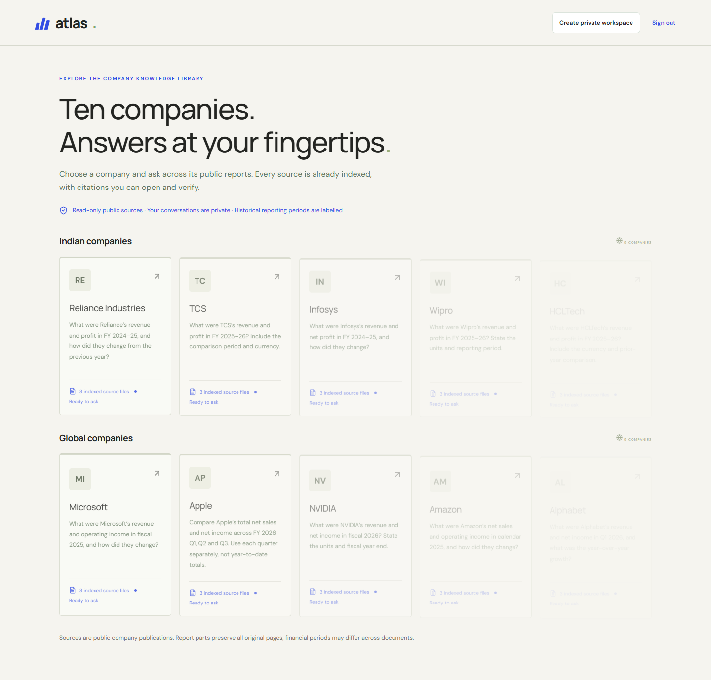

# Atlas

Company knowledge with source evidence. Built by Team Varanasi for the TriCity AI Hackathon.

[Live application](https://atlas-varanasi.vercel.app) · [Local setup](docs/SETUP.md) · [Architecture](docs/ARCHITECTURE.md) · [Verification](docs/VERIFICATION.md)

## The problem

Employees repeatedly ask managers and subject experts questions whose answers already exist in company files. Atlas lets an employer maintain a shared knowledge base and gives employees a conversational way to find the relevant policy, process, or report.

## Workflow

1. An employer verifies their account and creates a private company workspace.
2. An administrator uploads approved files, organizes collections, and invites employees.
3. Employees ask questions within the workspace.
4. Atlas retrieves relevant passages and generates answers with source references.
5. Employees open the cited text or original document and escalate unresolved questions.



## Features

- Email-code signup and recovery, password login, and email-bound invitations.
- Administrator/employee roles, organization-scoped data access, and private file storage.
- Document upload, collections, asynchronous indexing, progress, retry, and deletion.
- Hybrid vector/full-text retrieval, passage ranking, streamed answers, and source cards.
- Private conversation history, company switching, and an expandable prompt editor.
- Ten public demo companies with three prepared files each. Suggested questions run locally without model requests.

## Technology

| Layer | Implementation |
| --- | --- |
| Frontend | Next.js, React, TypeScript, CSS |
| API and ingestion | Python, FastAPI, Uvicorn, isolated parsing processes |
| Identity and data | Supabase Auth, PostgreSQL, pgvector, RLS, private Storage |
| Language and embeddings | OpenRouter with ordered routes and a dedicated free-model key |
| Email | Brevo |
| Hosting | Vercel frontend, Render API and worker |

## Local development

Use Node.js 24 and Python 3.12. A configured Supabase project and API credentials are required.

```bash
npm ci
python -m venv .venv
# Activate .venv, then:
pip install -r services/api/requirements.txt
```

Copy `secrets.env.example` to `secrets.env` and `apps/web/.env.example` to `apps/web/.env.local`. Fill the values and configure Supabase using [the setup guide](docs/SETUP.md).

```bash
# Terminal 1, from services/api
python -m uvicorn atlas.main:app --host 127.0.0.1 --port 8000
# Terminal 2, from services/api
python -m atlas.worker
# Terminal 3, from the repository root
npm run dev
```

Open http://localhost:3000. The package contains source and public demo documents, not an offline database export.

## Repository layout

```text
apps/web/             Web application
services/api/atlas/    API, authentication, retrieval, and ingestion
services/api/tests/    Backend regression tests
supabase/migrations/  Database schema, policies, retrieval, and job queue
scripts/              Demo preparation, live verification, and packaging
demo-data/            Public source catalog and preparation manifests
docs/                 Setup, architecture, security, and verification
render.yaml           Render deployment configuration
```

The downloadable archive also includes `demo/` and supplemental public documents. Git and frontend deployments exclude large demo binaries, local diagnostics, and credentials.

## Checks

```bash
python -m pytest
npm run build
npm run typecheck
```

CI repeats backend tests and the frontend build without production credentials. Live integration tests require a dedicated configured project and may send emails or consume API credit.

## Current scope

Atlas handles PDF, DOCX, CSV/TSV, XLSX, PPTX, plain text, Markdown, common code/configuration files, images, and bounded ZIP archives. Default limits include 25 MB per upload, 1,500 PDF pages, and 8,000 chunks per file.

Citations help users inspect evidence. They do not guarantee correct interpretation, arithmetic, or citation alignment. Review original sources for important decisions. [Verification](docs/VERIFICATION.md) records the known answer-quality limitations. Free hosting can have cold starts; free inference endpoints have provider quotas and privacy restrictions.

Enterprise SSO, external connectors, version comparison, and general deterministic financial analytics are outside this release. Public demo publishers retain ownership of their documents. See [NOTICE](NOTICE.md).
