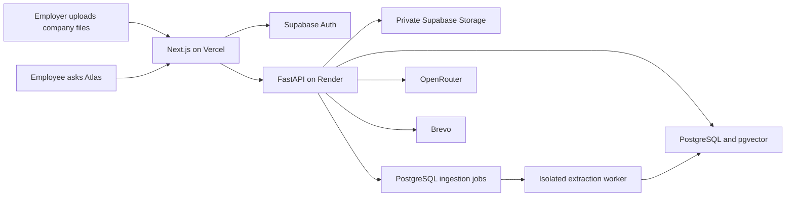

# Architecture

## Responsibilities

Administrators maintain company knowledge and employee access. Employees consult authorized documents through chat and inspect cited passages. Conversations remain private to the user within the workspace.

## Ingestion

Validate administrator access and input limits, store the private original, enqueue a leased job, extract in a disposable process, chunk text with source locations, generate 1536-dimensional embeddings, and publish after indexing. Deletion removes searchable evidence and cancels relevant jobs.

Public demo preparation runs locally before publication so judges do not trigger large-report parsing during their first question.

## Question processing

1. Verify confirmed identity and workspace access, then enforce limits and collection scope.
2. Split subquestions and apply limited prior user-question context to referential follow-ups.
3. Search indexed document chunks using vector similarity and PostgreSQL full-text matching.
4. Rank with BM25-style scoring, reserve evidence for subquestions, and deduplicate passages.
5. Build the RAG context from authorized passages with numbered source IDs and page/paragraph/row/line metadata. Prior model assertions are not evidence.
6. Generate and stream the answer. Bounded batch generation handles large numbered question lists.
7. Apply citation consistency and source-ID checks, handle abstention, and recheck cited-document access. The UI can replace streamed text after final checks.
8. Save private conversation history and expose cited passages and access-checked temporary links to originals.

Paid embedding failures use the existing company-scoped keyword index for chat. New files still need embeddings before their semantic index can publish.

## Routing

Paid answers prefer GLM 5.3 Flash, DeepSeek V4.1 Flash, GPT-6 Luna (OpenAI then Azure), and Qwen 3.8 Flash. Free fallbacks prefer Nemotron 3 Ultra and Apodex 1.1 Mini. Free routes use the dedicated key and enforce zero prompt/completion price. Embeddings use the primary key.

A 60-second paid-budget cooldown avoids repeated failing requests and permits recovery after a top-up. Partial output is never concatenated with another attempt. Authentication, privacy policies, free quotas, and provider availability still apply.

## Evidence limits

Citation checks are consistency safeguards, not comprehensive factual-entailment verification. Correct source IDs can still accompany wrong interpretation or arithmetic. The release provides evidence inspection and abstention controls; `VERIFICATION.md` records known limitations.
